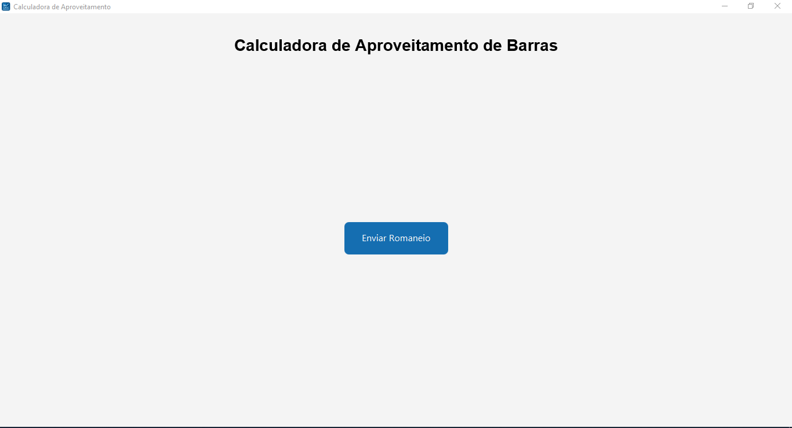
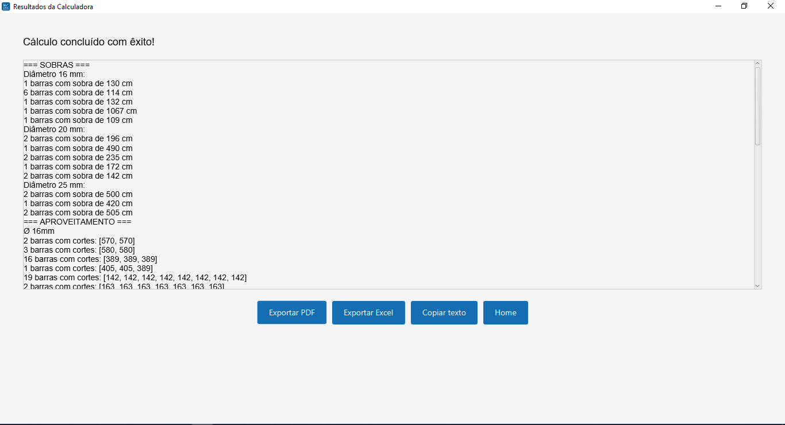
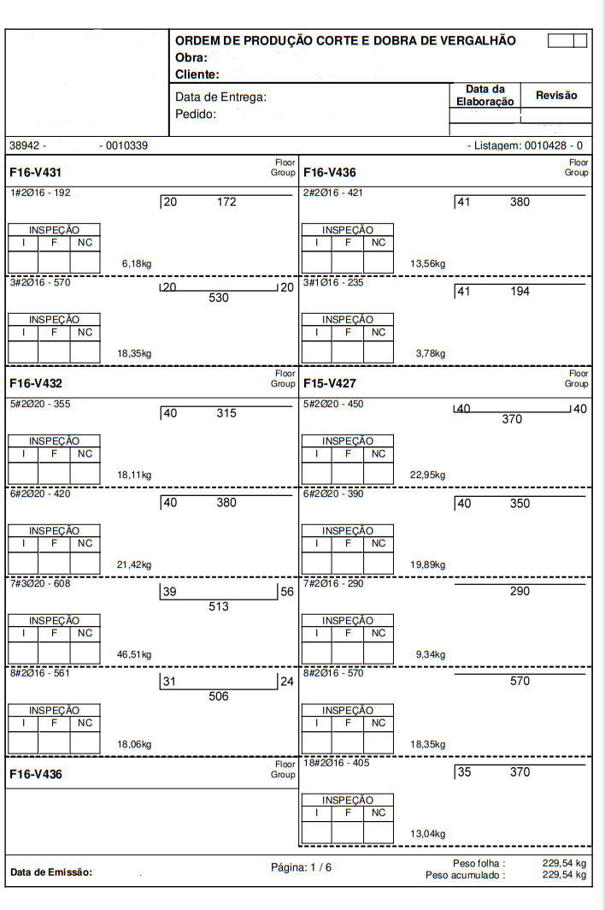

# Bar Optimization System

## Description

The **Bar Optimization System** is a JavaFX desktop application developed in Java that reads a cut list from a PDF containing bar details (position, quantity, diameter, and length), applies a first-fit decreasing optimization algorithm to minimize waste and group cuts by diameter, and generates reports:

- Display of results in the graphical interface.
- Export to PDF and Excel.

## Table of Contents

- [Description](#description)
- [Features](#features)
- [Prerequisites](#prerequisites)
- [Technologies](#technologies)
- [Getting Started](#getting-started)
    - [Clone the repository](#clone-the-repository)
    - [Build with Maven](#build-with-maven)
    - [Run the application](#run-the-application)
- [Project Structure](#project-structure)
- [Main Classes](#main-classes)
- [Screenshot](#screenshot)
- [Sample Files](#sample-files)
- [Contributing](#contributing)
- [License](#license)
- [Contact](#contact)


## Features

1. **PDF Parsing**: Uses Apache PDFBox to extract text from PDF files in the format `number#numberØnumber - number`.
2. **Bar Optimization**: First-fit decreasing algorithm that packs cuts into 12-meter bars (1200 cm), minimizing leftover scraps.
3. **Scrap Grouping**: Identifies scraps greater than or equal to 1 meter (100 cm) and groups them by quantity.
4. **Excel Export**: Generates spreadsheets with cuts and scraps using Apache POI.
5. **PDF Export**: Creates formatted PDF reports with headers, footers, and page breaks.
6. **Graphical Interface**: JavaFX implementation with screens for file selection and result display.

## Prerequisites

- Java 21 or higher
- Maven 3.8+
- Internet access (to download Maven dependencies)

## Technologies

- **Programming Language**: Java 21
- **GUI**: JavaFX 21
- **PDF Processing**: Apache PDFBox 3.0.4
- **Excel Export**: Apache POI 5.4.0
- **Testing**: JUnit 5.10.0
- **Build Tool**: Maven

## Getting Started

### Clone the repository

```bash
git clone https://github.com/LuisBarrichello/bar-optimization-system.git
cd bar-optimization-system
```

### Build with Maven

```bash
mvn clean install
```

### Run the application

```bash
mvn clean javafx:run -DmainClass=calculator.bar_optimization_system.InterfaceCalculatorApplication
```

## Project Structure

```
src/main/java/
├── calculator/bar_optimization_system/
│   ├── InterfaceCalculatorApplication.java   # JavaFX entry point
│   ├── interfaces/
│   │   ├── HomeScreen.java                   # Main screen
│   │   └── ResultScreen.java                 # Results screen
│   ├── inputFile/
│   │   ├── FilePDF.java                      # PDF reading and parsing
│   │   └── ExtractData.java                  # Regex data extractor
│   ├── optimizers/
│   │   ├── BarOptimizer.java                 # Optimization logic
│   │   └── OptimizationResult.java           # Optimization result model
│   └── exporters/
│       ├── ExcelExporter.java                # Excel export
│       └── PdfExporter.java                  # PDF export
└── resources/
    ├── images/icon.png                       # Application icon
    └── fonts/arial/arial.ttf                 # PDF font
```

## Main Classes

- **InterfaceCalculatorApplication**: Initializes the JavaFX application.
- **HomeScreen**: Handles PDF file selection.
- **ResultScreen**: Displays optimization results.
- **ExtractData**: Extracts cut list entries using regex.
- **BarOptimizer**: Implements the optimization algorithm and formats results.
- **ExcelExporter**: Exports results to `.xlsx` files.
- **PdfExporter**: Generates formatted `.pdf` reports.

## Screenshot

#### Intefaces



##### Input


## Sample Files

- [Download example cut‑list PDF](assets/samples/sobras_e_aproveitamento.pdf)
- [Download example report Excel](assets/samples/sobras_e_aproveitamento.xlsx)

## Contributing

Contributions are welcome! To contribute:

1. Fork the repository.
2. Create a feature branch `feature/your-feature`.
3. Commit your changes and add tests.
4. Open a pull request describing your changes.

## License

This project is licensed under the **Apache License 2.0**. See the [LICENSE](LICENSE) file for details.

## Contact

Developed by Luís Gabriel B. — [LinkedIn](https://www.linkedin.com/in/luisgabrielbarrichello/)